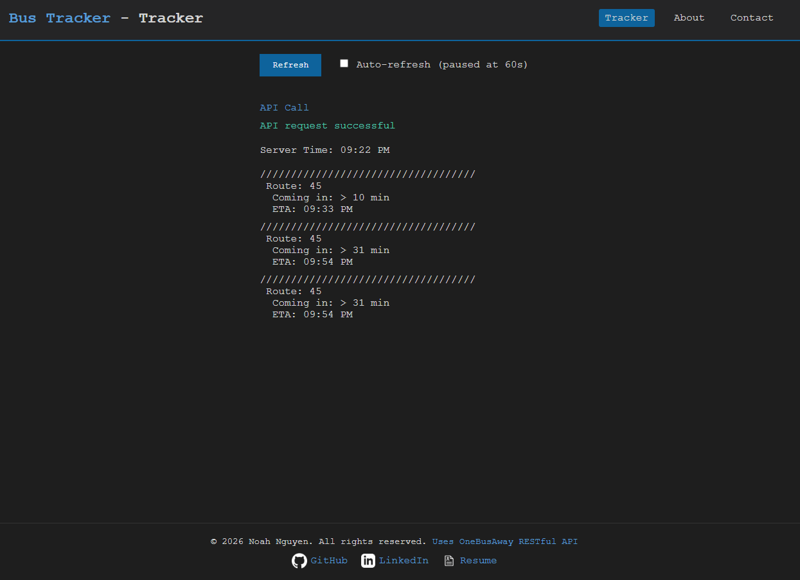

## Bus Tracker | Full-Stack Web Application

Bus Tracker is a real-time web application that displays live bus arrival and tracking information using the OneBusAway API. The backend is built with Spring Boot and exposes RESTful endpoints, while the frontend provides a clean, responsive interface for interacting with transit data. The application is designed to be easily scalable to support multiple stops, routes, and arrival feeds.

This is my first project outside of school ever! Bus Tracker was built to solve a real-world problem I encountered daily while commuting on the Route 45 outside my house to the University of Washington. I wanted a faster, more focused way to view arrival times for my regular bus route without the frills and tediousness of navigating a full transit app. This became my first end-to-end software project and an opportunity to explore full-stack development, API integration, and deployment workflows while also improving my life.

The project is designed to demonstrate full-stack development concepts, including RESTful APIs, Docker, frontend–backend integration, and deployment using GitHub Pages and Render.

### Features

- 🚌 Real-time bus arrival times and ETAs based on API server time
- 🔄 Manual and automatic (60-second) refresh options
- 💻 Clean, responsive user interface
- 🔌 RESTful API built with Spring Boot
- 🌐 Static frontend deployed via GitHub Pages
- 🖥️ Optional console-based output using `busTrackerToConsole.java`

### Technologies & Tools

- **Backend:** Java, Spring Boot
- **Frontend:** HTML, CSS, JavaScript
- **API:** OneBusAway REST API
- **Deployment:** GitHub Pages (frontend), Spring Boot server (local backend)

### What I Learned

- How to structure a Spring Boot application to cleanly separate API and frontend concerns
- Access and parse JSON from API to use as data for application
- Managing multiple deployment targets (local backend vs. GitHub Pages frontend)
- Designing user-facing features around real-time data constraints
- How to deploy S to Render.com

### Screenshots

Below are screenshots showcasing the core functionality of the application.

#### Main Tracker View

#### Auto-Refresh

### Planned Improvements

- 🌦️ Integrate a weather API to display clothing recommendations based on temperature
- 🗺️ Add support for selecting multiple routes and bus stops dynamically
- ⏱️ Improve refresh logic with smarter polling and error handling
- 📱 Enhance mobile responsiveness and UI accessibility
- 📟 Create physical display with hardware using ESP32 and E-ink screen

### Live Demo

🔗 https://bustracker-sgyt.onrender.com/

### Running Locally

1. Clone the repository
2. Obtain API key by emailing oba_api_key@soundtransit.org with name, email and agreement to terms of use
3. Put API key into .env file as API_KEY=API KEY
4. Open repo with preferred IDE
5. Navigate to: src\main\java\com\example\bustracker\busTrackerApplication.java
6. Hit Run
7. Open `http://localhost:8080` in your browser
8. Witness the real-time Route 45 arrivals outside of my house!
